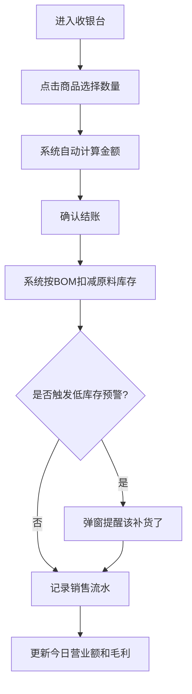
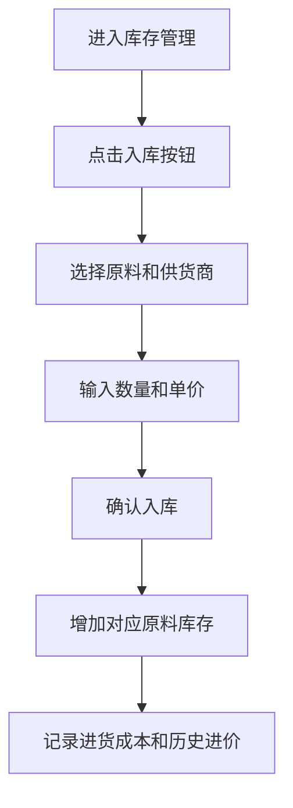
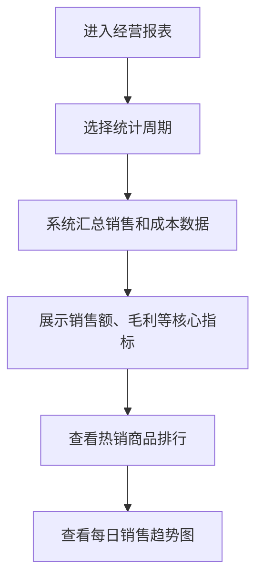

## 1. 产品概述

早餐店进销存管理系统，专为小型早餐店设计的一站式经营管理工具。解决店主手工记账繁琐、库存混乱、利润不清楚、进货无计划等痛点。

- 目标用户：早餐店店主/店员
- 核心价值：简化收银流程、自动扣减库存、实时计算毛利、智能补货提醒、经营数据分析

## 2. 核心功能

### 2.1 用户角色

| 角色 | 注册方式 | 核心权限 |
|------|---------|---------|
| 店主 | 本地首次使用初始化 | 全部功能，包括查看报表、供货商管理、系统设置 |

### 2.2 功能模块

1. **收银台首页**：快捷选品、数量加减、自动算价、一键结账
2. **库存管理**：原料入库、库存查看、低库存预警提醒
3. **商品管理**：售卖商品列表、BOM配方配置（用料配比）、售价设置
4. **供货商管理**：供货商信息、联系电话、历史进货价记录
5. **经营报表**：日/周销售额、毛利统计、热销商品排行、最旺日期分析
6. **进货记录**：原料采购登记、成本记录

### 2.3 页面详情

| 页面名称 | 模块名称 | 功能描述 |
|---------|---------|---------|
| 收银台 | 商品选择区 | 大按钮展示包子、油条、豆浆、稀饭、茶叶蛋，支持数量加减 |
| 收银台 | 当前订单区 | 显示已选商品、数量、单价、小计、合计金额 |
| 收银台 | 结账操作区 | 一键结账按钮，自动扣减对应原料库存 |
| 收银台 | 顶部状态栏 | 今日营业额、今日订单数、库存预警提示红点 |
| 库存管理 | 原料列表 | 显示面粉、油、黄豆、鸡蛋、调料的当前库存、单位、最低阈值 |
| 库存管理 | 入库操作 | 选择原料、输入数量、单价、供货商，记录入库 |
| 库存管理 | 预警提醒 | 低于阈值的原料红色高亮 + 弹窗提醒 |
| 商品管理 | 商品列表 | 5种商品展示，可编辑售价 |
| 商品管理 | BOM配方 | 每个商品配置消耗的原料及用量（如1个包子耗0.05斤面粉） |
| 供货商管理 | 供货商列表 | 名称、电话、主营原料 |
| 供货商管理 | 进货价记录 | 历史进价对比，显示涨跌幅 |
| 经营报表 | 日期选择 | 今日/本周/自定义日期范围 |
| 经营报表 | 销售概览 | 总销售额、总成本、总毛利、毛利率 |
| 经营报表 | 热销排行 | 按销量排序的商品柱状图 |
| 经营报表 | 按日分析 | 本周每日销售额折线图，标记最旺日期 |
| 进货记录 | 采购历史 | 按时间倒序的进货记录列表，可筛选原料 |

## 3. 核心流程

### 3.1 日常收银流程

### 3.2 进货入库流程

### 3.3 查看经营数据流程

## 4. 用户界面设计

### 4.1 设计风格

- **主色调**：暖橙色系（#FF6B35 主色 + #FFD93D 辅色），呼应早餐温暖、有活力的氛围
- **点缀色**：新鲜绿色（#6BCB77）用于成功/正常状态，警示红色（#FF4757）用于低库存预警
- **背景**：浅米色（#FFF8F0），搭配微妙的噪点纹理增加质感
- **按钮风格**：大圆角胶囊按钮，带有柔和阴影，点击有微弹动画
- **字体**：标题用 "ZCOOL KuaiLe" 活泼手写体，正文用 "Noto Sans SC" 清晰易读
- **布局风格**：卡片式布局，顶部导航 + 侧边栏菜单
- **图标**：Emoji 风格图标（🥟 🍞 🥚 🍵 👨‍🌾），贴合餐饮场景

### 4.2 页面设计概览

| 页面名称 | 模块名称 | UI 元素 |
|---------|---------|---------|
| 收银台 | 商品选择区 | 5张大卡片（2-3列网格），每卡含emoji图标、商品名、单价、+-按钮、数量显示，选中状态有橙色边框高亮 |
| 收银台 | 当前订单区 | 右侧固定面板，白底圆角卡片，每行显示商品名×数量=小计，底部大字体显示合计金额 |
| 收银台 | 结账按钮 | 底部全宽橙红色渐变按钮，带"结账 ¥xxx"文字，点击有缩放动画 |
| 库存管理 | 原料列表 | 表格形式，库存不足行红色背景闪烁，进度条显示库存占比 |
| 经营报表 | 数据卡片 | 4个统计卡片并排，大号数字 + 趋势小箭头，卡片有渐变色背景 |
| 经营报表 | 图表区 | 柱状图和折线图，橙色主题，柱子hover高亮 |

### 4.3 响应式

- **桌面优先**：收银台采用左右分栏（左商品区70%，右订单区30%）
- **平板适配**：断点 768px，订单区折叠为底部抽屉
- **触控优化**：所有按钮最小尺寸 48×48px，适合手指点击

## 5. 数据说明（预置初始数据）

### 5.1 商品列表
- 包子：¥2.00 / 个，BOM：面粉0.05斤、调料0.01斤
- 油条：¥2.50 / 根，BOM：面粉0.08斤、油0.02斤
- 豆浆：¥3.00 / 杯，BOM：黄豆0.03斤、调料0.005斤
- 稀饭：¥2.00 / 碗，BOM：面粉0.02斤
- 茶叶蛋：¥1.50 / 个，BOM：鸡蛋0.1个、调料0.01斤

### 5.2 原料列表
- 面粉：库存50斤，最低阈值10斤，参考进价¥3.50/斤
- 食用油：库存20斤，最低阈值5斤，参考进价¥12.00/斤
- 黄豆：库存15斤，最低阈值3斤，参考进价¥5.00/斤
- 鸡蛋：库存100个，最低阈值30个，参考进价¥0.80/个
- 调料：库存10斤，最低阈值2斤，参考进价¥8.00/斤
