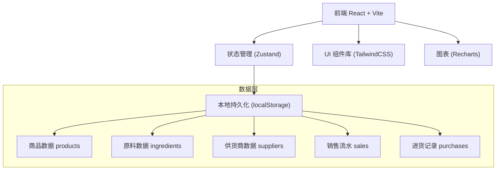
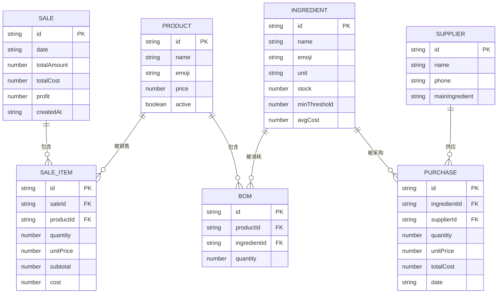

## 1. 架构设计



## 2. 技术描述

- **前端框架**：React@18 + TypeScript
- **构建工具**：Vite@5
- **样式方案**：TailwindCSS@3 + PostCSS
- **状态管理**：Zustand（轻量级，适合小型应用）
- **图表库**：Recharts（React 生态，轻量易集成）
- **数据持久化**：localStorage + zustand-persist 中间件
- **图标方案**：使用 emoji 字符 + Lucide React 补充图标
- **后端**：无（纯前端本地应用，数据保存在浏览器本地）
- **数据库**：localStorage（模拟数据库，按 key 分区存储不同业务数据）

## 3. 路由定义

| 路由 | 页面名称 | 用途 |
|------|---------|-----|
| / | 收银台 | 日常点单结账，默认首页 |
| /inventory | 库存管理 | 原料库存查看、入库操作、低库存预警 |
| /products | 商品管理 | 商品列表、售价编辑、BOM 配方配置 |
| /suppliers | 供货商管理 | 供货商信息维护、历史进价查看 |
| /reports | 经营报表 | 销售/毛利/热销/趋势分析 |
| /purchases | 进货记录 | 采购历史记录查看 |

## 4. 数据模型

### 4.1 ER 图



### 4.2 数据结构定义（TypeScript）

```typescript
// 商品
interface Product {
  id: string;
  name: string;
  emoji: string;
  price: number;
  active: boolean;
}

// 原料
interface Ingredient {
  id: string;
  name: string;
  emoji: string;
  unit: string;
  stock: number;
  minThreshold: number;
  avgCost: number;
}

// BOM配方
interface BomItem {
  id: string;
  productId: string;
  ingredientId: string;
  quantity: number;
}

// 供货商
interface Supplier {
  id: string;
  name: string;
  phone: string;
  mainIngredient: string;
}

// 进货记录
interface Purchase {
  id: string;
  ingredientId: string;
  supplierId: string;
  quantity: number;
  unitPrice: number;
  totalCost: number;
  date: string;
}

// 销售流水
interface Sale {
  id: string;
  date: string;
  totalAmount: number;
  totalCost: number;
  profit: number;
  createdAt: string;
  items: SaleItem[];
}

interface SaleItem {
  id: string;
  productId: string;
  productName: string;
  quantity: number;
  unitPrice: number;
  subtotal: number;
  cost: number;
}

// 购物车（收银台临时状态）
interface CartItem {
  productId: string;
  productName: string;
  emoji: string;
  price: number;
  quantity: number;
}
```

### 4.3 localStorage 存储结构

```typescript
interface AppState {
  products: Product[];
  ingredients: Ingredient[];
  bom: BomItem[];
  suppliers: Supplier[];
  purchases: Purchase[];
  sales: Sale[];
}
```

## 5. 核心业务逻辑说明

### 5.1 结账流程逻辑
1. 遍历购物车中每项商品
2. 根据商品ID查询BOM配方，计算每种原料的消耗总量
3. 校验库存是否充足（任一原料不足则提示并阻止结账）
4. 扣减各原料库存
5. 计算该笔订单成本（Σ原料用量 × 原料均价）
6. 生成 Sale 记录并持久化

### 5.2 库存预警逻辑
- 每次库存变动后（销售扣减/入库增加）遍历所有原料
- 如果 `ingredient.stock <= ingredient.minThreshold` 则触发预警
- 预警状态存入 store，收银台顶部显示红点，库存页红底高亮

### 5.3 移动平均成本计算
每次入库后更新原料均价：
```
newAvgCost = (oldStock * oldAvgCost + purchaseQty * purchasePrice) / (oldStock + purchaseQty)
```

### 5.4 报表统计逻辑
- **日汇总**：按 `sale.date` 分组，聚合销售额、成本、利润
- **热销排行**：遍历 `sales[].items[]`，按 `productId` 汇总 `quantity`
- **按日趋势**：取最近7天（或自定义范围），按日期绘制折线图

## 6. 项目文件结构

```
src/
├── components/          # 通用组件
│   ├── Layout/          # 布局组件（侧边栏、顶部栏）
│   ├── Card/            # 卡片容器
│   ├── Modal/           # 弹窗
│   └── Button/          # 按钮
├── pages/               # 页面组件
│   ├── Cashier.tsx      # 收银台
│   ├── Inventory.tsx    # 库存管理
│   ├── Products.tsx     # 商品管理
│   ├── Suppliers.tsx    # 供货商管理
│   ├── Reports.tsx      # 经营报表
│   └── Purchases.tsx    # 进货记录
├── store/               # Zustand 状态管理
│   └── useAppStore.ts
├── types/               # TypeScript 类型定义
│   └── index.ts
├── data/                # 初始模拟数据
│   └── seedData.ts
├── utils/               # 工具函数
│   ├── date.ts
│   ├── money.ts
│   └── id.ts
├── App.tsx
├── main.tsx
└── index.css
```
